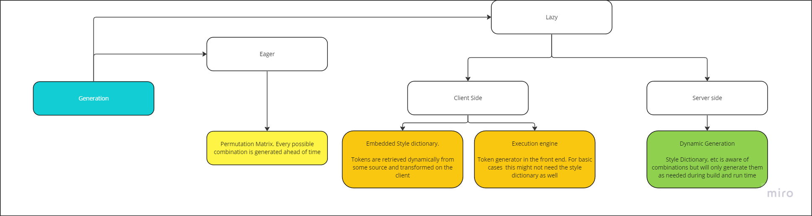
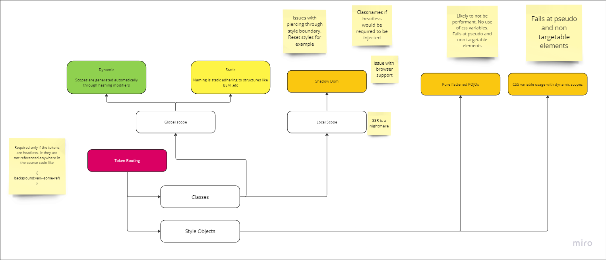

# POC React contextual design

This is a demo showing one possible path of using a React context to handle the different approaches for tokenization in a headless design system 

There are 3 major parts to tokens systems 

1. Export Generation

How are tokens files generated from source. Are all possible variants generated up front as standalone files? Are they merged into one single file. Is generation delayed until needed?

These decisions are up to the consumer and a headless design system would not need to push for any one choice over the other, however it can help by setting a default so that users can start immediately. 

This would likely be a style dictionary config which reads token source files and generates css variables for importing into token contexts.

2. Data Retrieval

Once the tokens have been generated, data retrieval is the process of getting them into the runtime of the system. This would likely be done through the use of imports of the tokens files through the use of the js module loading system. Tokens could be eagerly loaded, thus removing any asynchronous or runtime nature and therefore easier to use with static analysis tools, or it could be dynamic with data only be requested as needed

2. Routing

Routing refers to getting the tokens to the actual needed components. There are 2 portions 

1. In a headless system, tokens and their classes exist independently of components which are purely functional. Getting the appropriate classes to the elements relies on routing the appropriate values to the components through the use of selectors to attach the classes or style objects on to the elements.

2. In addition to standard routing there is also the need to support context sensitive design where scopes need to be generated for components as well as handling which tokens need to be applied based on contextual modifiers

Aside from export generation, which should be indepenent of the system but produces artifacts which affect how data retrieval works, the rest of the system should be able to be handled via the use of context structures like React Contexts which can handle abstracting away the inner systems of each approach. 

Using javascripts first class support for functions, users configure the context provider with their specific use case and then use hooks and HOCs within their code so the the provider can handle it behind the scenes

This repo shows an example of a context using a shadow dom with imports of both a css file to handle the mapping as well as css variable files